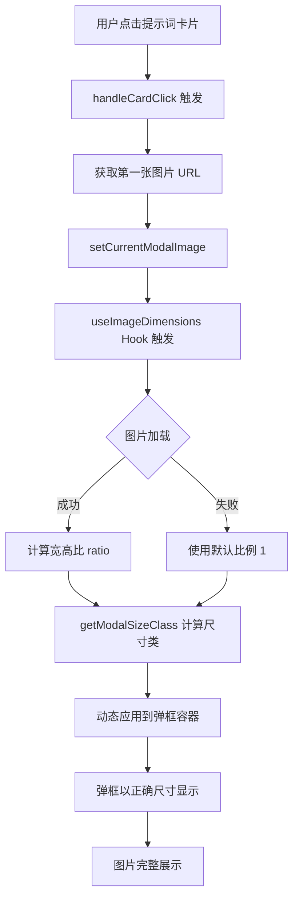

# 自适应弹出框技术方案

## 需求分析

用户希望在点击提示词卡片后弹出的详情框能够根据**第一张图片的实际比例**自适应调整大小，确保图片能够完整展示而不被裁剪。

### 当前问题
- 弹出框使用固定的 `max-w-3xl`（约768px）宽度
- 图片在容器内使用 `object-contain` 但容器高度受限
- 不同比例的图片（横向/纵向/正方形）展示效果不佳

### 目标
1. 横向图片（如 16:9）→ 弹出框更宽
2. 纵向图片（如 9:16）→ 弹出框更窄更高
3. 正方形图片（1:1）→ 中等尺寸
4. 图片完整展示，不截取任何部分

---

## 技术方案

### 核心思路

```
图片加载 → 获取宽高比 → 计算最佳弹框尺寸 → 动态应用样式
```

### 1. 新增图片尺寸检测 Hook

```javascript
// 在 App.jsx 中添加自定义 Hook
const useImageDimensions = (imageUrl) => {
  const [dimensions, setDimensions] = useState({ width: 0, height: 0, ratio: 1, loaded: false });
  
  useEffect(() => {
    if (!imageUrl) return;
    const img = new Image();
    img.onload = () => {
      setDimensions({
        width: img.naturalWidth,
        height: img.naturalHeight,
        ratio: img.naturalWidth / img.naturalHeight,
        loaded: true
      });
    };
    img.src = imageUrl.includes('wsrv.nl') ? imageUrl : getOptimizedUrl(imageUrl, 1200);
  }, [imageUrl]);
  
  return dimensions;
};
```

### 2. 根据比例计算弹框尺寸类

```javascript
const getModalSizeClass = (ratio) => {
  if (!ratio || ratio === 1) return 'max-w-2xl'; // 正方形：中等
  if (ratio > 1.5) return 'max-w-5xl';           // 横向宽图：更宽
  if (ratio > 1.2) return 'max-w-4xl';           // 横向图：宽
  if (ratio < 0.7) return 'max-w-lg';            // 纵向高图：更窄
  if (ratio < 0.9) return 'max-w-xl';            // 纵向图：窄
  return 'max-w-2xl';                            // 接近正方形：中等
};
```

### 3. 修改弹出框容器

**修改位置：** 第1233行 `isPromptModalOpen` 弹出框

**当前代码：**
```jsx
<div className="bg-white/95 backdrop-blur-md w-full max-w-3xl max-h-[90vh] rounded-3xl ...">
```

**修改后：**
```jsx
<div className={`bg-white/95 backdrop-blur-md w-full ${modalSizeClass} max-h-[90vh] rounded-3xl ...`}>
```

### 4. 修改 PromptViewer 组件

在 `PromptViewer` 组件中接收图片尺寸信息，并据此调整图片展示区域的样式：

```jsx
// PromptViewer 新增 props
const PromptViewer = memo(({ prompt, onSubmissionAction, imageDimensions }) => {
  // ...
  
  // 根据比例动态设置图片区域高度
  const getImageContainerStyle = () => {
    if (!imageDimensions.loaded) return { minHeight: '300px' };
    const ratio = imageDimensions.ratio;
    if (ratio > 1.5) return { maxHeight: '50vh' };  // 横向图：限制高度
    if (ratio < 0.7) return { maxHeight: '70vh' };  // 纵向图：允许更高
    return { maxHeight: '60vh' };                    // 中等
  };
  
  // ...
});
```

---

## 修改涉及的代码位置

| 文件 | 行号 | 修改内容 |
|------|------|----------|
| `src/App.jsx` | ~70行 | 添加 `useImageDimensions` Hook |
| `src/App.jsx` | ~391行 | 修改 `PromptViewer` 组件，接收并使用图片尺寸 |
| `src/App.jsx` | ~423行 | 修改图片容器样式为动态 |
| `src/App.jsx` | ~1233行 | 修改弹出框容器宽度为动态 |
| `src/App.jsx` | ~958行 | 在 `handleCardClick` 中预加载图片尺寸 |

---

## 详细实现步骤

### Step 1: 添加 useImageDimensions Hook（第70行附近）

```javascript
const useImageDimensions = (imageUrl) => {
  const [dimensions, setDimensions] = useState({ 
    width: 0, 
    height: 0, 
    ratio: 1, 
    loaded: false 
  });
  
  useEffect(() => {
    if (!imageUrl) {
      setDimensions({ width: 0, height: 0, ratio: 1, loaded: false });
      return;
    }
    
    const img = new Image();
    img.onload = () => {
      const w = img.naturalWidth;
      const h = img.naturalHeight;
      setDimensions({
        width: w,
        height: h,
        ratio: w / h,
        loaded: true
      });
    };
    img.onerror = () => {
      setDimensions({ width: 0, height: 0, ratio: 1, loaded: false });
    };
    // 使用优化后的 URL 来检测尺寸
    img.src = getOptimizedUrl(imageUrl, 100); // 用小图检测比例即可
  }, [imageUrl]);
  
  return dimensions;
};
```

### Step 2: 添加弹框尺寸计算函数（第85行附近）

```javascript
const getModalSizeClass = (ratio, loaded) => {
  if (!loaded) return 'max-w-3xl'; // 默认中等尺寸
  
  // 横向图（宽 > 高）
  if (ratio >= 1.8) return 'max-w-6xl';   // 超宽（如 21:9）
  if (ratio >= 1.5) return 'max-w-5xl';   // 宽幅（如 16:9）
  if (ratio >= 1.2) return 'max-w-4xl';   // 横向（如 4:3）
  
  // 纵向图（高 > 宽）
  if (ratio <= 0.5) return 'max-w-md';    // 超高（如 9:21）
  if (ratio <= 0.7) return 'max-w-lg';    // 竖幅（如 9:16）
  if (ratio <= 0.85) return 'max-w-xl';   // 纵向（如 3:4）
  
  // 接近正方形
  return 'max-w-2xl';
};
```

### Step 3: 在 App 组件中添加状态

```javascript
// 在 App 组件内，约第635行附近添加
const [currentModalImage, setCurrentModalImage] = useState(null);
const imageDimensions = useImageDimensions(currentModalImage);
const modalSizeClass = useMemo(() => 
  getModalSizeClass(imageDimensions.ratio, imageDimensions.loaded), 
  [imageDimensions]
);
```

### Step 4: 修改 handleCardClick

```javascript
const handleCardClick = useCallback((prompt) => {
  setEditingPrompt(prompt);
  // 获取第一张图片用于计算弹框尺寸
  const images = Array.isArray(prompt.images) && prompt.images.length > 0 
    ? prompt.images 
    : (prompt.image ? [prompt.image] : []);
  setCurrentModalImage(images.length > 0 ? images[0] : null);
  setIsPromptModalOpen(true);
}, []);
```

### Step 5: 修改弹出框容器（第1233行）

将：
```jsx
<div className="bg-white/95 backdrop-blur-md w-full max-w-3xl max-h-[90vh] rounded-3xl overflow-hidden flex flex-col p-8 shadow-2xl ring-1 ring-white/50 animate-fade-in-up">
```

改为：
```jsx
<div className={`bg-white/95 backdrop-blur-md w-full ${modalSizeClass} max-h-[90vh] rounded-3xl overflow-hidden flex flex-col p-8 shadow-2xl ring-1 ring-white/50 animate-fade-in-up transition-all duration-300`}>
```

### Step 6: 修改 PromptViewer 图片容器（第423行）

将：
```jsx
<div className="relative w-full bg-slate-50/50 rounded-2xl overflow-hidden border border-slate-200/60 shadow-inner flex items-center justify-center group min-h-[300px]">
```

改为：
```jsx
<div 
  className="relative w-full bg-slate-50/50 rounded-2xl overflow-hidden border border-slate-200/60 shadow-inner flex items-center justify-center group"
  style={{ 
    minHeight: '200px',
    maxHeight: imageDimensions?.ratio < 0.8 ? '70vh' : '55vh' 
  }}
>
```

---

## 本地运行方法

```bash
# 1. 进入项目目录
cd nanobanana-website-main

# 2. 安装依赖（如果还没安装）
npm install

# 3. 启动开发服务器
npm run dev

# 4. 在浏览器中打开显示的地址（通常是 http://localhost:5173）
```

---

## 测试验证点

1. **横向图片测试**：上传/选择一张 16:9 的图片，验证弹框变宽
2. **纵向图片测试**：上传/选择一张 9:16 的图片，验证弹框变窄变高
3. **正方形图片测试**：上传/选择一张 1:1 的图片，验证中等尺寸
4. **多图切换测试**：确保切换图片时弹框尺寸保��一致（基于第一张图）
5. **无图片测试**：确保没有图片时使用默认尺寸

---

## 流程图



---

## 注意事项

1. **不修改现有功能**：所有修改都是新增或扩展，不删除任何现有代码
2. **向后兼容**：如果图片加载失败，使用默认的 `max-w-3xl`
3. **性能考虑**：使用小尺寸图片（100px）来检测比例，避免加载完整图片
4. **动画过渡**：添加 `transition-all duration-300` 使尺寸变化平滑
