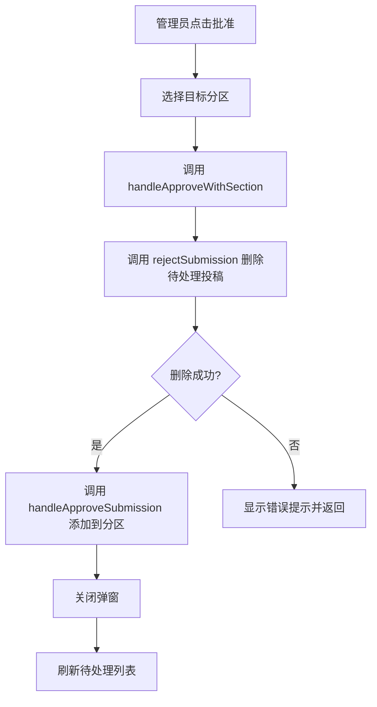

# 修复管理员批准投稿删除失败问题

## 问题描述

在管理员模式下，批准提示词到指定分区后，会显示错误：
```
❌ 从待处理分区删除失败: 删除投稿失败
```

## 问题分析

### 当前代码流程

1. **提交投稿** ([`api/submit.js`](api/submit.js:48))
   - 使用 Firebase REST API POST 请求创建文档
   - 文档 ID 由 Firebase 自动生成，格式类似 `abc123xyz789`

2. **获取待处理投稿** ([`api/get-submissions.js`](api/get-submissions.js:41))
   - 正确解析文档 ID：`const docId = doc.name.split('/').pop();`
   - 返回的 `id` 字段是正确的 Firestore 文档 ID

3. **批准投稿删除** ([`api/approve-submission.js`](api/approve-submission.js:32))
   - 使用 Firebase REST API DELETE 请求删除文档
   - URL 格式：`https://firestore.googleapis.com/v1/projects/${projectId}/databases/(default)/documents/${collection}/${submissionId}?key=${apiKey}`

### 根本原因

经过分析，问题可能出在以下几个方面：

1. **Firebase 安全规则限制**：Firestore 的安全规则可能不允许匿名用户（通过 API Key）删除文档。使用 REST API + API Key 只能进行读取操作，删除操作需要认证令牌。

2. **权限问题**：虽然 API Key 可以用于创建和读取文档，但删除操作通常需要更高的权限验证。

## 解决方案

### 方案 A：使用 Firebase Admin SDK（推荐）

在 Vercel Serverless Function 中使用 Firebase Admin SDK，它具有完全的服务器端权限，不受安全规则限制。

**修改步骤：**

1. 安装 `firebase-admin` 依赖
2. 配置 Firebase Admin 服务账号密钥
3. 重写 `approve-submission.js` 使用 Admin SDK

### 方案 B：调整 Firestore 安全规则（临时方案）

允许匿名用户删除 `pending_submissions` 集合中的文档（不推荐，存在安全风险）。

### 方案 C：使用 rejectSubmission 前端逻辑

注意到 [`src/firebase.js`](src/firebase.js:84-93) 中的 `rejectSubmission` 函数使用了前端 Firebase SDK 的 `deleteDoc`：

```javascript
export const rejectSubmission = async (submissionId) => {
  try {
    const docRef = doc(db, "pending_submissions", submissionId);
    await deleteDoc(docRef);
    return { success: true };
  } catch (error) {
    console.error("删除失败:", error);
    return { success: false, error: error.message };
  }
};
```

这个函数可能在管理员登录后拥有删除权限。我们可以统一使用这个方法。

## 推荐方案：方案 C（最小修改）

由于 `rejectSubmission` 已经实现了前端删除功能，并且管理员登录后应该有权限执行删除，我们可以：

1. **修改 [`src/App.jsx`](src/App.jsx:1069-1081) 中的 `handleApproveWithSection` 函数**：
   - 改用 `rejectSubmission` 或直接使用前端 Firebase SDK 的 `deleteDoc`
   - 不再调用 `/api/approve-submission` API

### 具体修改

**文件：`src/App.jsx`**

修改 [`handleApproveWithSection`](src/App.jsx:1069-1081) 函数：

```javascript
// 🔴 处理批准投稿（带分区选择）
const handleApproveWithSection = useCallback(async (submission, sectionId) => {
  // 改用前端 Firebase SDK 删除（因为管理员已登录）
  const result = await rejectSubmission(submission.id); // rejectSubmission 就是删除操作
  if (!result.success) {
    alert("❌ 从待处理分区删除失败: " + (result.error || "未知错误"));
    return;
  }
  // 成功后添加到指定分区
  handleApproveSubmission(submission, sectionId);
  setViewingSubmission(null);
  setSelectedSection(null);
  setPendingRefreshKey(prev => prev + 1);
}, [handleApproveSubmission]);
```

这样做的好处：
- 复用现有的 `rejectSubmission` 函数
- 管理员登录后拥有 Firebase 认证，可以执行删除操作
- 无需修改后�� API

## 待办清单

- [ ] 修改 `src/App.jsx` 中的 `handleApproveWithSection` 函数，改用 `rejectSubmission` 删除待处理投稿
- [ ] 测试批准投稿功能是否正常工作
- [ ] 确认投稿被添加到指定分区
- [ ] 确认投稿从待处理列表中删除

## 流程图


